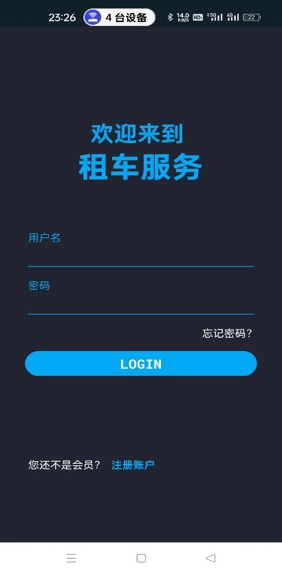
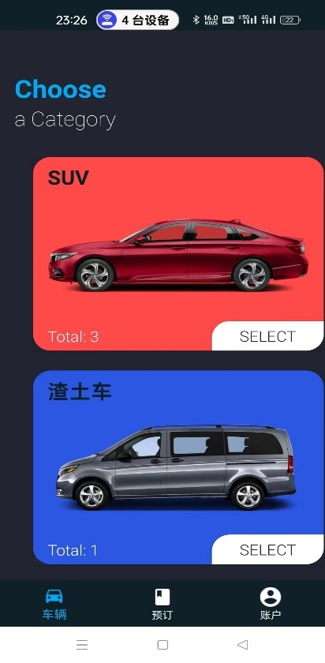
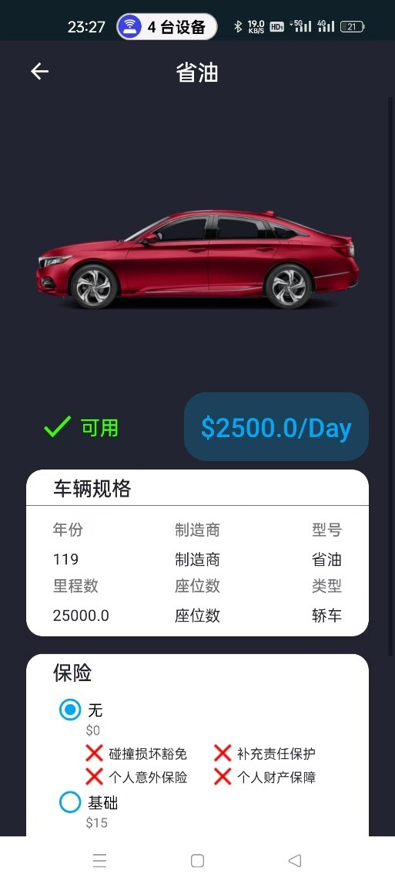
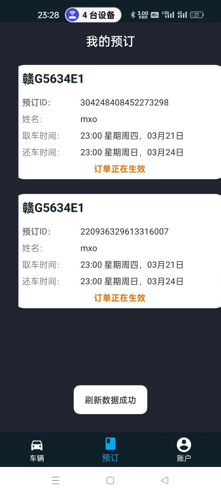

# 汽车租赁APP
---

### 概述
🚗 汽车租赁APP提供便捷的汽车租赁服务，用户可以通过应用浏览车辆信息、预订车辆、完成支付及管理订单。设计重点在于用户体验，提供直观界面和流畅交互，以满足不同的租车需求。


### 系统架构
该系统采用客户端-服务器（CS）架构：

- **客户端**: 安卓移动端应用，提供用户界面和交互功能，实现汽车租赁服务的浏览、查询、预订等操作。
- **服务器端**: 后端服务器处理客户端请求，实现业务逻辑和数据处理功能，使用数据库存储数据。

### 前端客户端设计

- **界面设计**
  - **车辆列表**: 简洁直观，车辆信息以列表或卡片形式展示，支持搜索和筛选功能。
  - **车辆详情**: 展示车辆参数、配置和租车费用，用户可查看车辆图片并预订。
  - **预订页面**: 直观的填写界面，采用日历和时间选择器，方便选择租车日期和时长。
  - **支付页面**: 支持多种支付方式，提供模拟支付功能，支付成功后生成订单。
  - **订单管理**: 用户可以查看、管理已预订的订单，支持订单取消和申请退款。

- **设计风格**: 现代化UI设计风格，包括清晰的字体、醒目的颜色和直观的布局，提升用户体验。

### 环境要求
- **Android SDK**: 30及以上
- **开发语言**: Kotlin、Java
- **架构**: MVVM（Model-View-ViewModel）
- **依赖库**:
  - OkHttp: 网络请求
  - Room: 数据库管理
  - Lifecycle, ViewModel, LiveData: 管理UI数据

### 安装与运行
1. 克隆项目到本地:
   ```bash
   git clone https://github.com/yourusername/CarRentalApp.git
   ```
2. 使用Android Studio打开项目并加载所需依赖。
3. 配置Android模拟器或连接真实设备进行调试。
4. 编译并运行应用。

### 截图展示
- **登录界面** {:width="400px"}
- **车辆列表页面** {:width="400px"}
- **车辆详情页面** {:width="400px"}
- **订单管理页面** {:width="400px"}